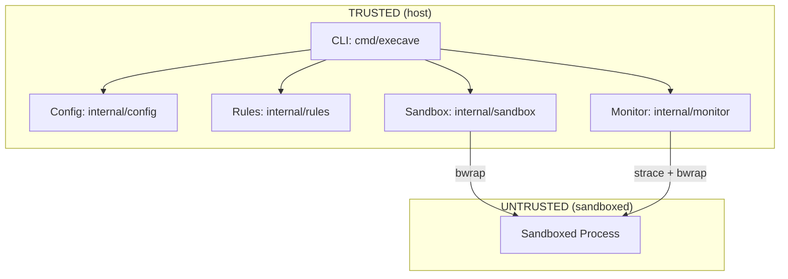

# Architecture

Execave is a process and filesystem sandboxing CLI. It wraps commands in a bubblewrap (`bwrap`) sandbox that starts empty (default-deny) and only exposes paths explicitly allowed in the config.

## Components

### Config (`internal/config/`)

- Rule syntax: `fs:<permission>:<path>`
- Symlinks resolved at runtime by rules, not during config parsing
- Duplicate paths are rejected
- Config file cannot be explicitly listed as writable

See security-model.md for path normalization risks.

### Rules (`internal/rules/`)

Provides rule matching used by both sandbox and monitor. The sandbox uses rule matching to determine config file access level (for forcing read-only). The monitor uses it to attribute runtime accesses for logging.

- Most-specific path wins (longest prefix matching)
- `PermissionFor`: returns permission for a path
- `CheckAccess`: resolves symlinks and checks operation permission

### Sandbox (`internal/sandbox/`)

- Translates rules to bwrap args:
  - `fs:rw` → `--bind`
  - `fs:ro` → `--ro-bind`
  - `fs:none` → `--tmpfs` (directories) or `--bind /dev/null` (files)
- Mount ordering: shortest paths first (parents before children); children overlay parents

See security-model.md for bwrap arg risks.

#### Automatic vs. Explicit Mounts

**Automatic:** `/dev`, `/proc`, `/tmp` (require special bwrap args)

**Explicit (must be in config):** Everything else—`/usr`, `/lib`, `/lib64`, `/sys`, dynamic linker files, user data. See `execave.json.example`.

#### Working Directory

The sandboxed process inherits the host's working directory. If the host cwd is not mounted in the sandbox, bwrap automatically falls back to `/`.

#### Process Isolation

Uses `--unshare-all --share-net` for process isolation (PID, IPC, UTS, cgroup namespaces) while allowing network access. Uses `--new-session` to detach the controlling terminal. Environment variables pass through from the host.

### Monitor (`internal/monitor/`)

Optional (`--monitor`). Traces filesystem access via strace and logs with rule attribution.

- Wraps bwrap: `strace -- bwrap [args] -- cmd`
- Resolves symlinks, matches against rules
- Symlinks targeting managed paths (`/tmp`, `/dev`, `/proc`) logged as UNKNOWN (host can't resolve sandbox-internal filesystems)
- Filters out infrastructure paths and bwrap internals
- Logs only user-controllable filesystem access

## Data Flow

**Startup:** CLI parses args → loads config → builds rules → executes `bwrap` (or `strace + bwrap` with `--monitor`)

**Runtime:** Kernel enforces namespace isolation (mount, PID, IPC). Monitor (if enabled) logs access with rule attribution.

## Dependencies

- `bwrap` (required)
- `strace` (`--monitor` only)

