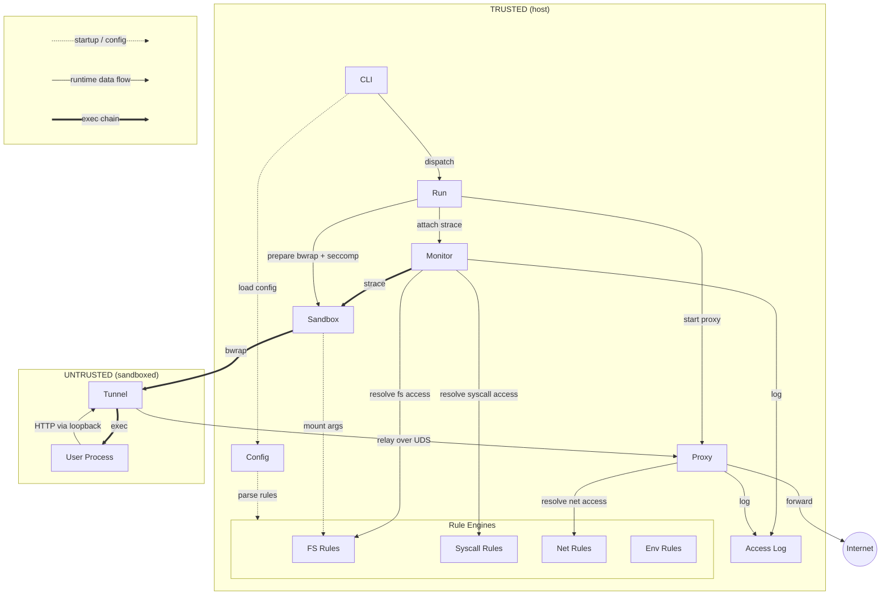

# Architecture

Execave is a default-deny sandbox CLI. It wraps commands in bubblewrap (`bwrap`) with an empty namespace and only exposes paths, syscalls, and network targets explicitly allowed in a TOML config.

## Execution Flow

CLI parses args → loads config → creates rule resolvers → dispatches:

- **`run`** command: sandbox only. `run.Run()` starts proxy, prepares bwrap+seccomp, executes command.
- **`monitor`** command: sandbox + strace. Logs filesystem, syscall, and network access with rule attribution. Output to file (`--output`) or stderr.
- **`config show`** command: renders effective merged config with source comments. No execution.

At runtime, the kernel enforces namespace isolation. Network traffic flows: process → tunnel (loopback) → proxy (UDS) → internet. The proxy checks each request against net rules. Monitor and proxy both log to the shared access log.

## Packages

| Package | Path | Role |
|---------|------|------|
| **Config** | `internal/config/` | TOML parsing, `extends` chain resolution, rule routing to domain parsers, rule merging/dedup/validation, effective-config rendering |
| **FS Rules** | `internal/fsrules/` | Parses `<permission>:<path>` rules, most-specific-wins matching, symlink resolution. Used by sandbox (mounts) and monitor (attribution) |
| **Net Rules** | `internal/netrules/` | Parses `<protocol>:<target>:<port>` rules (domains, wildcards, IPs, CIDRs), specificity matching, default-deny. Used by proxy |
| **Syscall Rules** | `internal/syscallrules/` | Parses `allow:<name>` rules, validates against ruleable set from seccomp. Used by sandbox (seccomp filter) and monitor (strace tracing) |
| **Env Rules** | `internal/envrules/` | Parses `pass:<NAME>` rules, default-deny env filtering. Used by sandbox to build `--clearenv`/`--setenv` bwrap args |
| **Run** | `internal/run/` | Orchestrator. Wires together sandbox, monitor, proxy, resolvers, signal handling, and terminal state management |
| **Sandbox** | `internal/sandbox/` | Translates FS rules to bwrap mount args, builds seccomp filter pipe, returns ready-to-exec `SandboxedCommand`. Full namespace isolation via `--unshare-all` |
| **Seccomp** | `internal/seccomp/` | Builds cBPF deny-list filter blocking ~34 dangerous syscalls. Exposes raw bytes and pipe for bwrap `--seccomp <fd>` |
| **Monitor** | `internal/monitor/` | Wraps sandbox with strace, parses syscalls, logs fs/syscall access with rule attribution. Tracks per-pid cwd for relative path resolution |
| **Proxy** | `internal/proxy/` | HTTP forward proxy on UDS (host-side). CONNECT tunneling + HTTP forwarding, checked against net rules |
| **Tunnel** | `internal/tunnel/` | TCP-to-UDS bridge inside sandbox. Listens on loopback, relays to proxy, injects `HTTP_PROXY`/`HTTPS_PROXY`. Fail-closed |
| **Access Log** | `internal/accesslog/` | Logger with dedup and infrastructure path filtering. Writes formatted entries to an `io.Writer`. Shared sink for monitor and proxy |
| **Bin Util** | `internal/binutil/` | Resolves bwrap/strace via PATH with root-ownership validation, version checks (pinned: bwrap 0.11.x, strace 6.19), ELF interpreter detection |
| **Path Util** | `internal/pathutil/` | `ExpandPath` (tilde, relative→absolute) and `ShortenPath` (absolute→display form) |
| **Exit Code** | `internal/exitcode/` | Exit code propagation from sandboxed process |

## Sandbox Details

**Automatic mounts:** `/dev`, `/proc`, `/tmp`, ELF interpreter (auto-detected from bwrap's PT_INTERP).
**Everything else** (`/usr`, `/lib`, `/lib64`, user data, etc.) must be in the config.

The sandboxed process inherits the host cwd (falls back to `/` if not mounted). Environment variables are filtered by default-deny env rules: only variables with a `pass:<NAME>` rule in the `env` config section are forwarded into the sandbox via `--clearenv`/`--setenv` bwrap args. Network is fully isolated; the proxy-tunnel bridge is the only path out.

## Dependencies

- `bwrap` (required)
- `strace` (`monitor` only)
