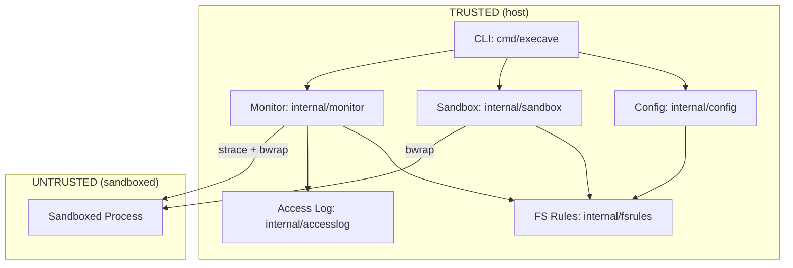

# Architecture

Execave is a process and filesystem sandboxing CLI. It wraps commands in a bubblewrap (`bwrap`) sandbox that starts empty (default-deny) and only exposes paths explicitly allowed in the config.

## Components

### Config (`internal/config/`)

- Loads JSON configuration and routes rules by resource prefix
- Routes `fs:` rules to `fsrules.Parse()`
- Rejects unknown resource prefixes
- Thin layer focused on JSON parsing and rule routing

### FS Rules (`internal/fsrules/`)

Self-contained FS rule engine handling parsing, validation, and resolution.

**Parsing and validation:**
- Rule syntax: `fs:<permission>:<path>`
- Path normalization (relative → absolute)
- Cross-rule validation: no duplicates, managed paths protected, config file not writable
- Symlinks resolved at runtime, not during config parsing

**Rule resolution:**
- Most-specific path wins (longest prefix matching)
- `PermissionFor`: returns permission for a path
- `CheckAccess`: resolves symlinks and checks operation permission
- Used by both sandbox (config file protection) and monitor (access attribution)

See security-model.md for path normalization risks.

### Access Log (`internal/accesslog/`)

Reusable access log writer with formatting, deduplication, and filtering.

- Entry format: `<OP> <PATH> <RESULT> <RULE>`
- Deduplication: each unique (operation, path, result) logged once
- Infrastructure filtering: `/dev`, `/proc`, `/tmp`, `/newroot`, `/oldroot`
- Used by monitor; extensible to other access sources (e.g., network proxy)

### Sandbox (`internal/sandbox/`)

- Translates rules to bwrap args:
  - `fs:rw` → `--bind`
  - `fs:ro` → `--ro-bind`
  - `fs:none` → `--tmpfs` (directories) or `--bind /dev/null` (files)
- Mount ordering: shortest paths first (parents before children); children overlay parents

See security-model.md for bwrap arg risks.

#### Automatic vs. Explicit Mounts

**Automatic:** `/dev`, `/proc`, `/tmp` (require special bwrap args)

**Explicit (must be in config):** Everything else—`/usr`, `/lib`, `/lib64`, `/sys`, dynamic linker files, user data. See `execave.json.example`.

#### Working Directory

The sandboxed process inherits the host's working directory. If the host cwd is not mounted in the sandbox, bwrap automatically falls back to `/`.

#### Process Isolation

Uses `--unshare-all --share-net` for process isolation (PID, IPC, UTS, cgroup namespaces) while allowing network access. Uses `--new-session` to detach the controlling terminal. Environment variables pass through from the host.

### Monitor (`internal/monitor/`)

Optional (`--monitor`). Traces filesystem access via strace and logs with rule attribution.

- Wraps bwrap: `strace -- bwrap [args] -- cmd`
- Parses strace output, maps syscalls to operations (READ/WRITE)
- Filters setup/infrastructure syscalls (bwrap's namespace creation)
- Uses `fsrules.Resolver` for symlink resolution and rule matching
- Filters non-existent path reads (via resolver's `PathNotFound` field)
- Constructs `accesslog.Entry` for each access and delegates to `accesslog.Logger`
- Symlinks targeting managed paths logged as UNKNOWN (host can't resolve sandbox-internal filesystems)

## Data Flow

**Startup:** CLI parses args → loads config (routes rules to `fsrules`) → creates resolver → creates access logger (if `--monitor`) → executes `bwrap` (or `strace + bwrap` with `--monitor`)

**Runtime:** Kernel enforces namespace isolation (mount, PID, IPC). Monitor (if enabled) traces syscalls, resolves via `fsrules`, logs via `accesslog`.

## Dependencies

- `bwrap` (required)
- `strace` (`--monitor` only)

