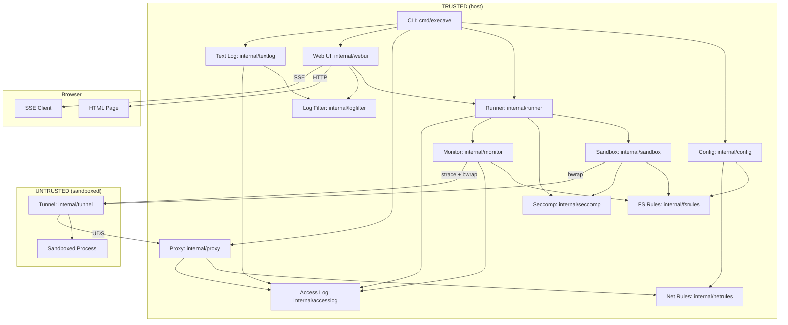

# Architecture

Execave is a process, filesystem, and network sandboxing CLI. It wraps commands in a bubblewrap (`bwrap`) sandbox that starts empty (default-deny) and only exposes paths and network targets explicitly allowed in the config.

## Components

### Config (`internal/config/`)

Loads TOML configuration and routes rules to domain-specific parsers. Thin layer focused on TOML parsing and rule routing by resource prefix (`fs:` vs `net:`). The default config filename is `execave.toml`.

### FS Rules (`internal/fsrules/`)

Self-contained filesystem rule engine. Parses `fs:<permission>:<path>` rules with validation, resolves permissions for paths using most-specific-wins matching, and handles symlink resolution at runtime. Paths support `~/...` tilde expansion and relative paths (resolved against the config file directory). Used by sandbox for mount configuration and monitor for access attribution.

See security-model.md for path normalization risks.

### Net Rules (`internal/netrules/`)

Self-contained network rule engine. Parses `net:<protocol>:<target>:<port>` rules supporting domains (with wildcards), IPs, and CIDRs. Resolves permissions using target specificity matching with default-deny. Used by proxy for request authorization.

### Access Log (`internal/accesslog/`)

In-memory access log with deduplication and pub/sub notifications. Filters infrastructure paths and notifies subscribers of new entries. Used by monitor (filesystem), proxy (network), and web UI (display).

### Runner (`internal/runner/`)

Manages lifecycle of monitored sandbox executions with start/stop control, status tracking, and automatic cleanup. Creates fresh access logs per run and handles terminal restoration. On exit, always resets escape-sequence-controlled terminal modes (cursor, mouse, focus), then conditionally clears the screen only if the terminal reports the alternate screen as active (DECRQM query). This preserves output from regular commands while cleaning up after killed TUI apps. When seccomp is enabled, creates the seccomp filter pipe and threads it through to the monitor. Bridges web UI and CLI with sandbox+monitor subsystems.

### Log Filter (`internal/logfilter/`)

Shared display logic used by both web UI and text log: `ShortenPath` reduces absolute paths to config-directory-relative or `~/...` form; `IsNolog` checks whether an entry matches any `fs:nolog`/`net:nolog`/`syscall:nolog` rule (delegating to `fsrules.LogResolver`, `netrules.LogResolver`, and a `syscallNolog` map).

### Web UI (`internal/webui/`)

Localhost web server (OS-assigned port, bound to `127.0.0.1`) for real-time access log viewing, config editing, and run control. Serves server-rendered HTML with SSE streaming for live updates. Filesystem target paths are displayed using `logfilter.ShortenPath`. Provides start/stop/save/revert controls that delegate to runner and config. The URL includes a random access token for authentication. Survives sandbox exit for log review; active when `--monitor` (web mode) is specified.

Accepts a `FilterDefaults` struct (`ShowAllowed`, `ShowNolog` bools) that sets the initial checkbox state for the two client-side filters: "Denied only" (hides OK entries) and "Apply nolog rules" (hides entries matching nolog rules). These can be overridden at startup via `--show-allowed` / `--show-nolog` CLI flags.

**Log visibility filtering:** The web UI applies two independent client-side filters. The "Denied only" filter (default: on) hides OK entries. The "Apply nolog rules" filter (default: on) hides entries matching `fs:nolog`/`net:nolog` rules (unless overridden by a more specific `fs:log`/`net:log` rule). SSE entry events carry a `nolog` boolean field so the client can apply nolog filtering without server round-trips. Both filters are display-only and do not affect the Logger or access enforcement.

### Text Log (`internal/textlog/`)

Alternative monitor output mode. `Writer` subscribes to an `accesslog.Logger`, applies the same denied-only and nolog filters as the web UI (controlled by `showAllowed`/`showNolog` constructor parameters), and writes one line per entry in `%-7s %-5s  %s  (%s)` format (result, operation, shortened target, rule). Used by the CLI when `--monitor=<path>` or `--monitor=-` is specified. Performs a final drain on context cancellation to capture entries generated after the last notification.

### Sandbox (`internal/sandbox/`)

Translates filesystem rules to bwrap mount arguments (`--bind`, `--ro-bind`, `--tmpfs`). When seccomp filtering is enabled (default), creates a seccomp filter pipe via `internal/seccomp` and passes it to bwrap via `--seccomp 3`. When network access or monitoring is enabled, injects proxy tunnel infrastructure into the sandbox namespace.

See security-model.md for bwrap arg risks.

#### Automatic vs. Explicit Mounts

**Automatic:** `/dev`, `/proc`, `/tmp` (require special bwrap args)

**Explicit (must be in config):** Everything else—`/usr`, `/lib`, `/lib64`, `/sys`, dynamic linker files, user data. See `execave.toml.example`.

#### Working Directory

The sandboxed process inherits the host's working directory. If the host cwd is not mounted in the sandbox, bwrap automatically falls back to `/`.

#### Process Isolation

Uses `--unshare-all` for full namespace isolation (PID, IPC, UTS, cgroup, network). On older kernels, uses `--new-session` to prevent TIOCSTI terminal injection; on Linux 6.2+ where the kernel blocks TIOCSTI, `--new-session` is skipped to allow SIGWINCH delivery for TUI applications. Environment variables pass through from the host. Network is isolated by default; when net rules are configured or monitoring is enabled, a proxy-tunnel bridge provides controlled access (or deny-all logging with no net rules).

### Seccomp (`internal/seccomp/`)

Builds a classic BPF (cBPF) seccomp deny-list filter that blocks ~34 dangerous syscalls (ptrace, BPF, io_uring, namespace manipulation, kernel module loading, etc.). Exposes `Filter() []byte` (raw bytes) and `FilterPipe() (*os.File, error)` (a pipe suitable for passing to bwrap via `--seccomp <fd>`). The filter rejects wrong-architecture programs with `KILL_PROCESS` and returns `EPERM` for blocked syscalls.

See security-model.md for seccomp filter risks.

### Proxy (`internal/proxy/`)

Forward HTTP proxy on Unix domain socket (host-side). Handles CONNECT tunneling and HTTP forwarding, checking requests against network rules. Denies unauthorized requests and logs all attempts when monitoring is enabled.

### Tunnel (`internal/tunnel/`)

TCP-to-UDS bridge running inside sandbox (untrusted side). Listens on loopback, relays connections to proxy UDS, and configures HTTP proxy environment variables. Wraps user command and propagates exit code. Fail-closed on infrastructure errors.

### Monitor (`internal/monitor/`)

Optional filesystem and syscall access tracer (`--monitor`). Wraps sandbox execution with strace, parses syscalls, and logs filesystem access with rule attribution. When seccomp is enabled, also traces blocked and allowed syscalls and logs them as `SYSCALL` entries. Tracks per-pid cwd from AT_FDCWD annotations, chdir, and fchdir to resolve bare-path relative syscalls. Filters infrastructure noise and resolves symlinks using filesystem rules. Logs to memory for web UI streaming. Note: strace uses ptrace, so if monitoring is enabled, the sandboxed process cannot use ptrace even if allowed by config (see security-model.md Limitations).

## Data Flow

**Startup:** CLI parses args → loads config (routes rules to `fsrules` and `netrules`) → creates resolvers → creates runner (if `--monitor`) → starts proxy (if net rules or monitoring) → dispatches by monitor mode:
- `--monitor` (web): starts web UI server with runner, opens browser, calls `runner.Start()`
- `--monitor=<path>`: creates `textlog.Writer` writing to file, calls `runner.Start()`, runs writer goroutine until process exits
- `--monitor=-`: same as file mode but writes to a buffer, flushed to stderr after exit
- no `--monitor`: executes `bwrap` directly (no runner, no monitor)

**Runtime (without net rules, no monitoring):** Kernel enforces namespace isolation (mount, PID, IPC, network). No network access. No proxy.

**Runtime (without net rules, monitoring enabled):** Same namespace isolation. Proxy-tunnel starts with an empty rule set (deny-all) so that HTTP-proxy-aware programs' access attempts are logged. Direct connections still fail (no NIC). Monitor traces syscalls, resolves via `fsrules`, logs via `accesslog`. Output goes to web UI (SSE streaming) or text log writer depending on mode.

**Runtime (with net rules):** Same namespace isolation. Inside the sandbox, the tunnel listens on loopback and bridges TCP to the proxy UDS. Proxy checks each request against net rules and forwards or denies. Both monitor (filesystem) and proxy (network) log to the same `accesslog`. If monitoring enabled, output goes to web UI or text log depending on mode.

**Shutdown (web UI mode):** After sandbox exits, web UI server remains accessible for log review. SIGINT exits immediately; the OS closes all connections.

**Shutdown (text log mode):** After sandbox exits, the writer goroutine is cancelled, performs a final drain, then the buffered output (stderr mode) is flushed.

## Dependencies

- `bwrap` (required)
- `strace` (`--monitor` only)

