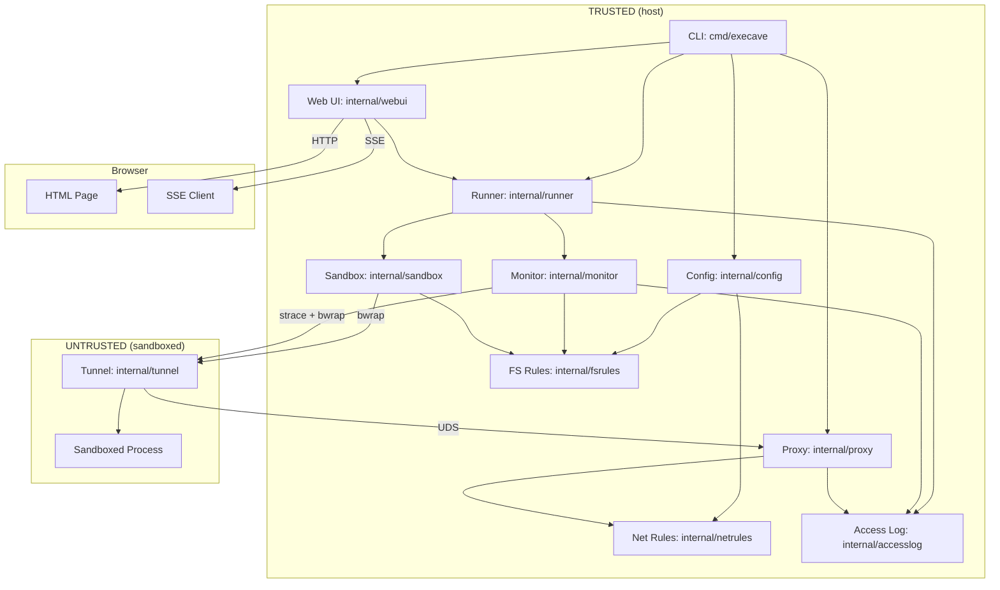

# Architecture

Execave is a process, filesystem, and network sandboxing CLI. It wraps commands in a bubblewrap (`bwrap`) sandbox that starts empty (default-deny) and only exposes paths and network targets explicitly allowed in the config.

## Components

### Config (`internal/config/`)

Loads TOML configuration and routes rules to domain-specific parsers. Thin layer focused on TOML parsing and rule routing by resource prefix (`fs:` vs `net:`). The default config filename is `execave.toml`.

### FS Rules (`internal/fsrules/`)

Self-contained filesystem rule engine. Parses `fs:<permission>:<path>` rules with validation, resolves permissions for paths using most-specific-wins matching, and handles symlink resolution at runtime. Paths support `~/...` tilde expansion and relative paths (resolved against the config file directory). Used by sandbox for mount configuration and monitor for access attribution.

See security-model.md for path normalization risks.

### Net Rules (`internal/netrules/`)

Self-contained network rule engine. Parses `net:<protocol>:<target>:<port>` rules supporting domains (with wildcards), IPs, and CIDRs. Resolves permissions using target specificity matching with default-deny. Used by proxy for request authorization.

### Access Log (`internal/accesslog/`)

In-memory access log with deduplication and pub/sub notifications. Filters infrastructure paths and notifies subscribers of new entries. Used by monitor (filesystem), proxy (network), and web UI (display).

### Runner (`internal/runner/`)

Manages lifecycle of monitored sandbox executions with start/stop control, status tracking, and automatic cleanup. Creates fresh access logs per run and handles terminal restoration. Bridges web UI and CLI with sandbox+monitor subsystems.

### Web UI (`internal/webui/`)

Localhost web server (`127.0.0.1:PORT`) for real-time access log viewing and run control. Serves server-rendered HTML with SSE streaming for live updates. Filesystem target paths are displayed in shortened form: relative to the config directory if the path is under it, otherwise `~/...` form if the path is under the home directory, otherwise absolute. Network targets (HTTPS/HTTP) are shown verbatim. Provides start/stop controls that delegate to runner. Survives sandbox exit for log review; active when `--monitor=PORT` is specified.

### Sandbox (`internal/sandbox/`)

Translates filesystem rules to bwrap mount arguments (`--bind`, `--ro-bind`, `--tmpfs`). When network access or monitoring is enabled, injects proxy tunnel infrastructure into the sandbox namespace.

See security-model.md for bwrap arg risks.

#### Automatic vs. Explicit Mounts

**Automatic:** `/dev`, `/proc`, `/tmp` (require special bwrap args)

**Explicit (must be in config):** Everything else—`/usr`, `/lib`, `/lib64`, `/sys`, dynamic linker files, user data. See `execave.toml.example`.

#### Working Directory

The sandboxed process inherits the host's working directory. If the host cwd is not mounted in the sandbox, bwrap automatically falls back to `/`.

#### Process Isolation

Uses `--unshare-all` for full namespace isolation (PID, IPC, UTS, cgroup, network). On older kernels, uses `--new-session` to prevent TIOCSTI terminal injection; on Linux 6.2+ where the kernel blocks TIOCSTI, `--new-session` is skipped to allow SIGWINCH delivery for TUI applications. Environment variables pass through from the host. Network is isolated by default; when net rules are configured or monitoring is enabled, a proxy-tunnel bridge provides controlled access (or deny-all logging with no net rules).

### Proxy (`internal/proxy/`)

Forward HTTP proxy on Unix domain socket (host-side). Handles HTTPS CONNECT tunneling and HTTP forwarding, checking requests against network rules. Denies unauthorized requests and logs all attempts when monitoring is enabled.

### Tunnel (`internal/tunnel/`)

TCP-to-UDS bridge running inside sandbox (untrusted side). Listens on loopback, relays connections to proxy UDS, and configures HTTP proxy environment variables. Wraps user command and propagates exit code. Fail-closed on infrastructure errors.

### Monitor (`internal/monitor/`)

Optional filesystem access tracer (`--monitor=PORT`). Wraps sandbox execution with strace, parses syscalls, and logs filesystem access with rule attribution. Filters infrastructure noise and resolves symlinks using filesystem rules. Logs to memory for web UI streaming.

## Data Flow

**Startup:** CLI parses args → loads config (routes rules to `fsrules` and `netrules`) → creates resolvers → creates runner (if `--monitor=PORT`) → starts web UI server with runner (if `--monitor=PORT`) → starts proxy (if net rules or monitoring) → calls `runner.Start()` for initial run (if monitoring) or executes `bwrap` directly (if not monitoring)

**Runtime (without net rules, no monitoring):** Kernel enforces namespace isolation (mount, PID, IPC, network). No network access. No proxy.

**Runtime (without net rules, monitoring enabled):** Same namespace isolation. Proxy-tunnel starts with an empty rule set (deny-all) so that HTTP-proxy-aware programs' access attempts are logged. Direct connections still fail (no NIC). Monitor traces syscalls, resolves via `fsrules`, logs via `accesslog`. Web UI serves initial page with all entries and streams updates via SSE. Browser connects to `http://127.0.0.1:PORT` to view real-time log.

**Runtime (with net rules):** Same namespace isolation. Inside the sandbox, the tunnel listens on loopback and bridges TCP to the proxy UDS. Proxy checks each request against net rules and forwards or denies. Both monitor (filesystem) and proxy (network) log to the same `accesslog`. If monitoring enabled, web UI displays both filesystem and network entries in real-time.

**Shutdown (monitoring enabled):** After sandbox exits, web UI server remains accessible for log review. SIGINT exits immediately; the OS closes all connections.

## Dependencies

- `bwrap` (required)
- `strace` (`--monitor` only)

