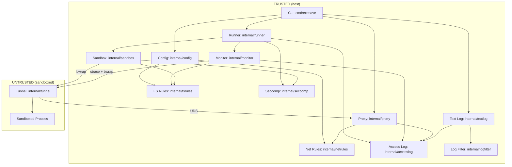

# Architecture

Execave is a process, filesystem, and network sandboxing CLI. It wraps commands in a bubblewrap (`bwrap`) sandbox that starts empty (default-deny) and only exposes paths and network targets explicitly allowed in the config.

## Components

### Config (`internal/config/`)

Loads TOML configuration with typed rule sections (`fs`, `net`, `syscall`) and routes rules to domain-specific parsers. Supports `extends` chains that resolve absolute, relative (to the extending file), or `~`-prefixed paths, reject cycles, validate each file independently, and track provenance so merged rules can point back to their original files before deduplication and validation. Also renders effective merged TOML (for `config show`) with per-rule source comments. Thin layer focused on TOML parsing, rule routing, and effective-config rendering. The default config filename is `execave.toml`. Rules within each section are prefixed with the resource type internally and passed to their respective validators.

### FS Rules (`internal/fsrules/`)

Self-contained filesystem rule engine. Parses rules with permission and path (format: `<permission>:<path>`) with validation, resolves permissions for paths using most-specific-wins matching, and handles symlink resolution at runtime. Paths support `~/...` tilde expansion and relative paths (resolved against the config file directory). Used by sandbox for mount configuration and monitor for access attribution.

See security-model.md for path normalization risks.

### Net Rules (`internal/netrules/`)

Self-contained network rule engine. Parses rules with protocol, target, and port (format: `<protocol>:<target>:<port>`) supporting domains (with wildcards), IPs, and CIDRs. Resolves permissions using target specificity matching with default-deny. Used by proxy for request authorization.

### Access Log (`internal/accesslog/`)

In-memory access log with deduplication and pub/sub notifications. Filters infrastructure paths and notifies subscribers of new entries. Used by monitor (filesystem) and proxy (network).

### Runner (`internal/runner/`)

Manages lifecycle of monitored sandbox executions with start/stop control, status tracking, and automatic cleanup. Creates fresh access logs per run and handles terminal restoration. On exit, always resets escape-sequence-controlled terminal modes (cursor, mouse, focus), then conditionally clears the screen only if the terminal reports the alternate screen as active (DECRQM query). This preserves output from regular commands while cleaning up after killed TUI apps. When seccomp is enabled, creates the seccomp filter pipe and threads it through to the monitor. Bridges CLI with sandbox+monitor subsystems.

### Log Filter (`internal/logfilter/`)

Shared display logic used by the text log: `ShortenPath` reduces absolute paths to config-directory-relative or `~/...` form; `IsNolog` checks whether an entry matches any `nolog` rule within its resource section (delegating to `fsrules.LogResolver`, `netrules.LogResolver`, and a `syscallNolog` map).

### Text Log (`internal/textlog/`)

Monitor output mode. `Writer` subscribes to an `accesslog.Logger`, applies denied-only and nolog filters (controlled by `showAllowed`/`showNolog` constructor parameters), and writes one line per entry in `%-7s %-5s  %s  (%s)` format (result, operation, shortened target, rule). Used by the CLI `monitor` command. Performs a final drain on context cancellation to capture entries generated after the last notification.

### Sandbox (`internal/sandbox/`)

Translates filesystem rules to bwrap mount arguments (`--bind`, `--ro-bind`, `--tmpfs`). When seccomp filtering is enabled (default), creates a seccomp filter pipe via `internal/seccomp` and passes it to bwrap via `--seccomp 3`. When network access or monitoring is enabled, injects proxy tunnel infrastructure into the sandbox namespace.

Performs startup version checks via `CheckBwrapVersion` and `CheckStraceVersion` after binary path resolution. Both functions enforce three compatibility tiers: OK (pinned minor series, no output), WARN (higher minor within same major, warning to stderr), ERROR (older or major-version bump, exit with error). Pinned versions: bwrap 0.11.x, strace 6.18. Version checks run after binary ownership validation (`ValidateBinary`) and before any sandbox or monitor operation.

See security-model.md for bwrap arg risks.

#### Automatic vs. Explicit Mounts

**Automatic:** `/dev`, `/proc`, `/tmp` (require special bwrap args), ELF interpreter (auto-detected from bwrap's PT_INTERP header, single file read-only bind-mount)

**Explicit (must be in config):** Everything else—`/usr`, `/lib`, `/lib64`, `/sys`, shared libraries, user data. See `execave.toml.example`.

#### Working Directory

The sandboxed process inherits the host's working directory. If the host cwd is not mounted in the sandbox, bwrap automatically falls back to `/`.

#### Process Isolation

Uses `--unshare-all` for full namespace isolation (PID, IPC, UTS, cgroup, network). On older kernels, uses `--new-session` to prevent TIOCSTI terminal injection; on Linux 6.2+ where the kernel blocks TIOCSTI, `--new-session` is skipped to allow SIGWINCH delivery for TUI applications. Environment variables pass through from the host. Network is isolated; a proxy-tunnel bridge enforces the configured net rules (deny-all if none are configured).

### Seccomp (`internal/seccomp/`)

Builds a classic BPF (cBPF) seccomp deny-list filter that blocks ~34 dangerous syscalls (ptrace, BPF, io_uring, namespace manipulation, kernel module loading, etc.). Exposes `Filter() []byte` (raw bytes) and `FilterPipe() (*os.File, error)` (a pipe suitable for passing to bwrap via `--seccomp <fd>`). The filter rejects wrong-architecture programs with `KILL_PROCESS` and returns `EPERM` for blocked syscalls.

See security-model.md for seccomp filter risks.

### Proxy (`internal/proxy/`)

Forward HTTP proxy on Unix domain socket (host-side). Handles CONNECT tunneling and HTTP forwarding, checking requests against network rules. Denies unauthorized requests and logs all attempts when monitoring is enabled.

### Tunnel (`internal/tunnel/`)

TCP-to-UDS bridge running inside sandbox (untrusted side). Listens on loopback, relays connections to proxy UDS, and configures HTTP proxy environment variables. Wraps user command and propagates exit code. Fail-closed on infrastructure errors.

**Intra-sandbox connectivity:** Because the proxy runs on the host, it resolves `localhost` against the host network namespace, not the sandbox's. A server bound to loopback inside the sandbox is unreachable through the proxy. To connect to an intra-sandbox server, bypass the proxy: `NO_PROXY=localhost,127.0.0.1` or `curl --noproxy localhost`. Direct loopback connections work because the sandbox still has a loopback interface.

### Monitor (`internal/monitor/`)

Optional filesystem and syscall access tracer (CLI `monitor` command). Wraps sandbox execution with strace, parses syscalls, and logs filesystem access with rule attribution. When seccomp is enabled, also traces blocked and allowed syscalls and logs them as `SYSCALL` entries. Tracks per-pid cwd from AT_FDCWD annotations, chdir, and fchdir to resolve bare-path relative syscalls. Filters infrastructure noise and resolves symlinks using filesystem rules. Logs to memory for text log output. Note: strace uses ptrace, so if monitoring is enabled, the sandboxed process cannot use ptrace even if allowed by config (see security-model.md Limitations).

## Data Flow

**Startup:** CLI parses args (`run`, `monitor`, or `config show`) with global `--config` → loads config (routes rules to `fsrules` and `netrules`) → creates resolvers → starts proxy → dispatches by command:
- `run`: executes `bwrap` directly (no runner, no monitor)
- `monitor --output <path>`: creates `textlog.Writer` writing to file, calls `runner.Start()`, runs writer goroutine until process exits
- `monitor` without flags: same as file mode but writes to a buffer, flushed to stderr after exit
- `config show`: renders effective merged TOML with source comments, no sandbox execution

**Runtime:** Kernel enforces namespace isolation (mount, PID, IPC, network). Inside the sandbox, the tunnel listens on loopback and bridges TCP to the proxy UDS. `HTTP_PROXY`/`HTTPS_PROXY` are injected. The proxy checks each request against net rules (deny-all if none configured) and forwards or denies. Both monitor (filesystem) and proxy (network) log to the same `accesslog`. If monitoring enabled, output goes to text log.

**Shutdown:** After sandbox exits, the writer goroutine is cancelled, performs a final drain, then the buffered output (stderr mode) is flushed.

## Dependencies

- `bwrap` (required)
- `strace` (`monitor` command only)
