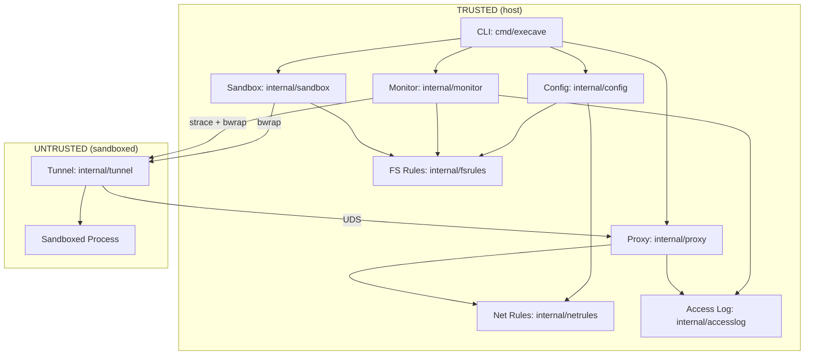

# Architecture

Execave is a process, filesystem, and network sandboxing CLI. It wraps commands in a bubblewrap (`bwrap`) sandbox that starts empty (default-deny) and only exposes paths and network targets explicitly allowed in the config.

## Components

### Config (`internal/config/`)

- Loads JSON configuration and routes rules by resource prefix
- Routes `fs:` rules to `fsrules.Parse()` and `net:` rules to `netrules.Parse()`
- Rejects unknown resource prefixes (not `fs:` or `net:`)
- Calls each rule package's cross-rule validation after parsing
- Thin layer focused on JSON parsing and rule routing

### FS Rules (`internal/fsrules/`)

Self-contained FS rule engine handling parsing, validation, and resolution.

**Parsing and validation:**
- Rule syntax: `fs:<permission>:<path>`
- Permissions: `rw`, `ro`, `none`
- Path normalization (relative → absolute)
- Cross-rule validation: no duplicates, managed paths protected, config file not writable
- Symlinks resolved at runtime, not during config parsing

**Rule resolution:**
- Most-specific path wins (longest prefix matching)
- `PermissionFor`: returns permission for a path
- `CheckAccess`: resolves symlinks and checks operation permission
- Used by both sandbox (config file protection) and monitor (access attribution)

See security-model.md for path normalization risks.

### Net Rules (`internal/netrules/`)

Self-contained net rule engine handling parsing, validation, and resolution.

**Parsing and validation:**
- Rule syntax: `net:<protocol>:<target>:<port>`
- Protocols: `https`, `http`, `none`
- Target types: domain (with optional wildcard), IPv4/IPv6, CIDR
- Parsing order: bracketed IPv6 → CIDR → IP → domain fallback
- Cross-rule validation: no duplicate `(target, port)` identity, no mixed port patterns per target

**Rule resolution:**
- Single-dimension target specificity: exact > wildcard (domains), longer prefix > shorter (CIDRs)
- Protocol compatibility: `none` matches any protocol
- Default-deny when no rule matches

### Access Log (`internal/accesslog/`)

Reusable access log writer with formatting, deduplication, and filtering.

- Entry format: `<OP> <TARGET> <RESULT> <RULE>`
- Operations: `READ`, `WRITE` (filesystem), `HTTPS`, `HTTP` (network)
- Deduplication: each unique (operation, target, result) logged once
- Infrastructure filtering: `/dev`, `/proc`, `/tmp`, `/newroot`, `/oldroot`
- Used by monitor (filesystem) and proxy (network)

### Sandbox (`internal/sandbox/`)

- Translates rules to bwrap args:
  - `fs:rw` → `--bind`
  - `fs:ro` → `--ro-bind`
  - `fs:none` → `--tmpfs` (directories) or `--bind /dev/null` (files)
- Mount ordering: shortest paths first (parents before children); children overlay parents

When net rules are configured or monitoring is enabled, the sandbox bind-mounts the proxy UDS (`/tmp/execave-proxy.sock`) and the execave binary (`/tmp/execave`) read-only, then wraps the user command with `execave network-tunnel`.

See security-model.md for bwrap arg risks.

#### Automatic vs. Explicit Mounts

**Automatic:** `/dev`, `/proc`, `/tmp` (require special bwrap args)

**Explicit (must be in config):** Everything else—`/usr`, `/lib`, `/lib64`, `/sys`, dynamic linker files, user data. See `execave.json.example`.

#### Working Directory

The sandboxed process inherits the host's working directory. If the host cwd is not mounted in the sandbox, bwrap automatically falls back to `/`.

#### Process Isolation

Uses `--unshare-all` for full namespace isolation (PID, IPC, UTS, cgroup, network). Uses `--new-session` to detach the controlling terminal. Environment variables pass through from the host. Network is isolated by default; when net rules are configured or monitoring is enabled, a proxy-tunnel bridge provides controlled access (or deny-all logging with no net rules).

### Proxy (`internal/proxy/`)

Forward HTTP proxy listening on a Unix domain socket. Runs on the host (trusted side).

- Handles CONNECT for HTTPS tunneling and plain HTTP forwarding
- Checks each request against `netrules.Resolver` allowlist
- Denied requests receive 403 Forbidden
- Logs each request to `accesslog.Logger` (if monitoring enabled)
- Lifecycle: `Start()` creates UDS → `Stop()` drains connections → removes UDS

### Tunnel (`internal/tunnel/`)

TCP-to-UDS bridge running inside the sandbox (untrusted side).

- Listens on `127.0.0.1:0` inside the sandbox
- Relays TCP connections to the proxy UDS
- Sets `HTTP_PROXY`/`HTTPS_PROXY`/`http_proxy`/`https_proxy` to `http://127.0.0.1:<port>`
- Unsets `NO_PROXY`/`no_proxy` (bypass would lose connectivity, not circumvent allowlist)
- Runs user command as subprocess, propagates exit code
- Fail-closed: exits non-zero if listener bind or UDS access fails

### Monitor (`internal/monitor/`)

Optional (`--monitor`). Traces filesystem access via strace and logs with rule attribution.

- Wraps bwrap: `strace -- bwrap [args] -- cmd`
- Parses strace output, maps syscalls to operations (READ/WRITE)
- Filters setup/infrastructure syscalls (bwrap's namespace creation)
- Uses `fsrules.Resolver` for symlink resolution and rule matching
- Filters non-existent path reads (via resolver's `PathNotFound` field)
- Constructs `accesslog.Entry` for each access and delegates to `accesslog.Logger`
- Symlinks targeting managed paths logged as UNKNOWN (host can't resolve sandbox-internal filesystems)

## Data Flow

**Startup:** CLI parses args → loads config (routes rules to `fsrules` and `netrules`) → creates resolvers → creates access logger (if `--monitor`) → starts proxy (if net rules or `--monitor`) → executes `bwrap` (or `strace + bwrap` with `--monitor`)

**Runtime (without net rules, no monitoring):** Kernel enforces namespace isolation (mount, PID, IPC, network). No network access. No proxy.

**Runtime (without net rules, monitoring enabled):** Same namespace isolation. Proxy-tunnel starts with an empty rule set (deny-all) so that HTTP-proxy-aware programs' access attempts are logged. Direct connections still fail (no NIC). Monitor traces syscalls, resolves via `fsrules`, logs via `accesslog`.

**Runtime (with net rules):** Same namespace isolation. Inside the sandbox, the tunnel listens on loopback and bridges TCP to the proxy UDS. Proxy checks each request against net rules and forwards or denies. Both monitor (filesystem) and proxy (network) log to the same `accesslog`.

## Dependencies

- `bwrap` (required)
- `strace` (`--monitor` only)

