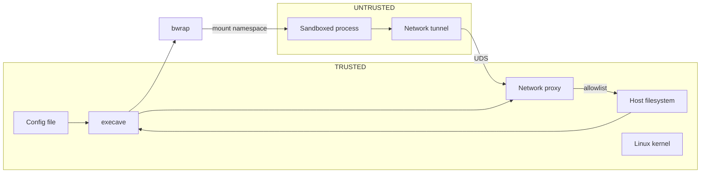

# Security Model

## Threat Model

Execave sandboxes untrusted processes (designed for running AI coding agents) via process and filesystem isolation. The adversary controls everything inside the sandbox but cannot modify execave or its config.

**Protected assets:** Sensitive files (`~/.ssh`, credentials), user data outside project scope, system files, other agents' workspaces.

## Trust Boundaries

## Guarantees

**Kernel-enforced via bwrap:**

| Guarantee | Mechanism |
|-----------|-----------|
| Paths not in config don't exist | Mount namespace isolation |
| `fs:ro` paths unwritable | Read-only bind mounts |
| `fs:none` paths inaccessible | Overlay with tmpfs + chmod 0000 (dirs) or /dev/null (files); dirs with child rules use chmod 0111 for traversal |
| Unlisted paths inaccessible | Default-deny (see architecture.md for mount details) |
| `..` traversal blocked | `filepath.Clean()` at config parse time |
| Symlinks can't escape | Target outside namespace → dangling |
| Config file protected | Config error if explicit; forced read-only if inherited from parent |
| Sandboxed process can't see host processes | PID namespace isolation |
| Sandboxed process can't signal host processes | PID namespace isolation |
| Sandboxed process can't share memory with host | IPC namespace isolation |
| Sandboxed process can't inject terminal input | `--new-session` (no controlling TTY) |
| No network access by default | Network namespace isolation (`--unshare-all` without `--share-net`) |
| Network access only via allowlist | Forward proxy on UDS enforces net rules; no NIC inside sandbox |
| No DNS exfiltration | No DNS resolver reachable from sandbox |
| No UDP/ICMP covert channels | No network stack; only TCP via proxy |

## Default-Deny Model

Execave distinguishes special filesystems (`/dev`, `/proc`, `/tmp`) from filesystem mounts (explicit only: everything else). See architecture.md for details.

This ensures complete visibility: the config file shows the **entire** filesystem access surface.

## Attacks & Mitigations

| Attack | Mitigation | Residual Risk |
|--------|------------|---------------|
| Read secrets, exfiltrate | Paths don't exist in namespace | Misconfiguration |
| Delete/corrupt files | Unmounted = inaccessible; ro = unwritable | rw paths can be destroyed |
| Symlink escape | Target doesn't exist → dangling | None |
| Path traversal (`../`) | Normalized before sandbox creation | Normalization bugs (fuzz tested) |
| TOCTOU race | Kernel enforcement, no userspace check | None |
| Lateral movement | Separate sandboxes per agent | Shared directory misconfiguration |
| Config tampering | Config error if explicit rw; forced read-only if inherited | Deletion = DoS only |
| Process enumeration | PID namespace - only sees own processes | None |
| Kill/signal host processes | PID namespace - host PIDs don't exist | None |
| Shared memory exploitation | IPC namespace isolation | None |
| Terminal injection (TIOCSTI, CVE-2017-5226) | `--new-session` detaches controlling TTY | None |
| Direct network access | No NIC in sandbox (network namespace isolation) | None |
| DNS exfiltration | No DNS resolver reachable from sandbox | None |
| UDP/ICMP covert channel | No network stack; only TCP relay via proxy | None |
| Bypass proxy via direct connection | No NIC; processes ignoring HTTP_PROXY cannot connect | None |
| Connect to unauthorized host | Proxy enforces allowlist with default-deny | Misconfigured rules |
| Proxy crash/failure | UDS: process death removes listener, new connections fail (fail-closed by design) | None |
| Tunnel binary tampering | Irrelevant: tunnel runs inside sandbox, only exit is UDS to host proxy which enforces filtering; read-only bind mount as defense in depth | None |

## Security-Critical Code

| Area | Risk | Implementation | Verification |
|------|------|----------------|--------------|
| Path normalization | `..`/`.` bypass | `filepath.Clean()` at config parse time | Fuzz tests + unit tests + e2e tests |
| Rule resolution | Wrong permission | Longest prefix matching algorithm | Fuzz tests + unit tests + e2e tests |
| bwrap args | Missing bind, wrong flags | Declarative mount generation | Unit tests + e2e tests |
| Mount ordering | Conflicting permissions | Parents first; children overlay | Integration tests + e2e tests |
| Config protection | Future-run escalation | Config validation rejects explicit rw; rule resolver determines inherited permission; synthetic ro rule overlays | Unit tests + e2e tests |
| Net rule resolution | Wrong allow/deny | Single-dimension target specificity: domains (exact > wildcard), IPs (longer CIDR prefix > shorter) | Fuzz tests + unit tests + e2e tests |
| Proxy allowlist | Unauthorized access | Default-deny; protocol+target+port matching via net rules | Unit tests + e2e tests |

## Safe Usage

- **Config:** Version control. Minimal permissions. Only mount necessary secrets as fs:ro (never fs:rw).
- **Testing:** Use `--monitor` to audit actual access patterns before trusting a config.
- **Incident:** Check file modifications (timestamps, git status) → review config → assess if access was excessive. (`--monitor` too expensive for regular use, so syscall logs typically unavailable.)

## Limitations

- No protection against privileged attackers (root, config modification)
- Not a container runtime
- Environment variables pass through from host (no filtering)
- Defense in depth, not a replacement for code review
- Linux only
- `fs:none` paths remain visible as entries in parent directory listings, but the directories themselves cannot be listed or written to (chmod 0000/0111)
- Monitor logs `UNKNOWN` for symlinks whose targets fall under managed paths (`/dev`, `/proc`, `/tmp`), because these filesystems exist only inside the sandbox's mount namespace and cannot be resolved from the host
- Monitor filters nonexistent paths from the log to reduce noise. Ephemeral files (created and deleted during execution) won't appear due to post-execution checking
