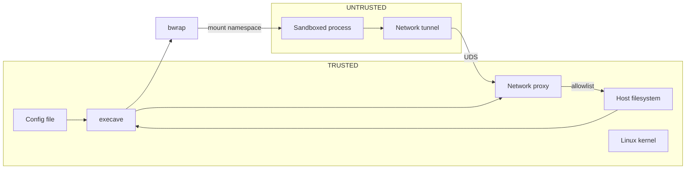

# Security Model

Execave sandboxes untrusted processes (designed for AI coding agents) using Linux kernel namespaces via bubblewrap (`bwrap`). The adversary controls everything inside the sandbox but cannot modify execave or its config.

**Protected assets:** sensitive files (`~/.ssh`, credentials), user data outside project scope, system files, other agents' workspaces.

## Trust Boundaries

## Isolation Mechanisms

**Filesystem** — mount namespace with default-deny. Only paths listed in config `fs` section exist inside the sandbox. `ro` paths use read-only bind mounts, `rw` paths use read-write bind mounts, `none` paths use tmpfs + chmod 0000 (dirs) or /dev/null (files). Managed paths (`/dev`, `/proc`, `/tmp`, ELF interpreter) are mounted automatically; everything else requires explicit config rules. The config file shows the entire filesystem access surface.

**Network** — network namespace with no NIC. The only exit path is a TCP relay: a tunnel binary inside the sandbox bridges loopback TCP to a host-side HTTP forward proxy via UDS. The proxy enforces rules in config `net` section (default-deny allowlist by protocol, target, and port). No DNS resolver is reachable. No UDP/ICMP. Fail-closed: if the proxy dies, the UDS disappears and new connections fail.

**Process** — PID namespace (can't see or signal host processes), IPC namespace (no shared memory with host).

**Syscalls** — seccomp-bpf deny-list blocks ~34 dangerous syscalls (ptrace, BPF, io_uring, namespace manipulation, privilege escalation). `allow:<name>` rules in the config `syscall` section can selectively re-enable ruleable syscalls; defense-in-depth syscalls (those already blocked by bwrap's user-namespace capability drop) cannot be re-enabled.

**Terminal** — TIOCSTI injection blocked by kernel (Linux 6.2+) or `--new-session` fallback (older kernels).

**Config protection** — merged validation rejects `rw` rules in the `fs` section targeting any config file in the extends chain; runtime adds forced read-only overlays when inherited rules would otherwise resolve a config path as writable.

**Binary validation** — bwrap and strace must be root-owned (Lstat check, blocks symlink injection). Strace is validated because it wraps bwrap from outside the sandbox with full host access.

## Attacks & Mitigations

| Attack | Mitigation | Residual Risk |
|--------|------------|---------------|
| Read secrets / exfiltrate | Paths don't exist in namespace | Misconfiguration |
| Delete / corrupt files | Unmounted = inaccessible; ro = unwritable | rw paths can be destroyed |
| Symlink escape | Target outside namespace → dangling | None |
| Path traversal (`../`) | `filepath.Clean()` at config parse time | Normalization bugs (fuzz tested) |
| TOCTOU race | Kernel enforcement, no userspace check | None |
| PATH injection (fake bwrap/strace) | Root-ownership Lstat validation | Root-compromised system |
| Config tampering | Merged validation + runtime ro overlays | Deletion = DoS only |
| Lateral movement | Separate sandboxes per agent | Shared directory misconfiguration |
| Terminal injection (TIOCSTI) | Kernel block (6.2+) or `--new-session` | None |
| Direct network access | No NIC in sandbox | None |
| DNS / UDP / ICMP exfiltration | No network stack; TCP-only via proxy | None |
| Bypass proxy (ignore HTTP_PROXY) | No NIC; cannot connect without proxy | None |
| Connect to unauthorized host | Proxy enforces allowlist (default-deny) | Misconfigured rules |
| Proxy crash | UDS removed on death (fail-closed) | None |
| Plaintext over CONNECT tunnel | None: non-MITM relay, cannot verify TLS | Plaintext if remote cooperates |
| Process / IPC attacks | PID + IPC namespace isolation | None |
| Dangerous syscalls | Seccomp-bpf deny-list | None |
| Resource exhaustion (fork bomb, tmpfs fill, OOM) | None: no cgroup limits | Sandbox can DoS host |
| Read host info via /proc | PID namespace hides processes | `/proc/cpuinfo`, `/proc/meminfo`, kernel tunables visible |
| Env var secrets (API keys, tokens) | None: env vars pass through unfiltered | Secrets available inside sandbox |

## Security-Critical Code

| Area | Implementation | Verification |
|------|----------------|--------------|
| Path normalization | `filepath.Clean()` after tilde/relative expansion; `~username` rejected | Fuzz + unit + e2e |
| FS rule resolution | Longest prefix match | Fuzz + unit + e2e |
| bwrap args | Declarative mount generation; parents first, children overlay | Unit + integration + e2e |
| Config protection | Per-file parse → merged validation → runtime ro overlays | Unit + e2e |
| Net rule resolution | Single-dimension target specificity (exact > wildcard, longer CIDR > shorter) | Fuzz + unit + e2e |
| Proxy allowlist | Default-deny; protocol + target + port matching | Unit + e2e |
| Binary validation | Lstat root-ownership on path entry | Unit |
| Seccomp filter | BPF deny-list: arch check → per-syscall JEQ → KILL_PROCESS on wrong arch | Unit |
| Syscall allow rules | `allow:<name>` in config `syscall` section removes syscall from BPF deny-list; validated at parse time | Unit + integration + e2e |

## Seccomp Details

Of ~34 blocked syscalls, 13 are **defense-in-depth** (already kernel-prevented inside bwrap's user-namespace sandbox) and 21 are **ruleable** (can be selectively allowed via config). Defense-in-depth syscalls are blocked silently; ruleable syscalls produce `SYSCALL DENY` entries in the monitor access log.

**Ruleable:** `ptrace`, `bpf`, `io_uring_setup`, `io_uring_enter`, `io_uring_register`, `reboot`, `mount`, `umount2`, `unshare`, `setns`, `pivot_root`, `chroot`, `open_tree`, `move_mount`, `fsopen`, `fsconfig`, `fsmount`, `fspick`, `keyctl`, `add_key`, `request_key`.

**Defense-in-depth:** `kexec_load`, `kexec_file_load`, `init_module`, `finit_module`, `delete_module`, `settimeofday`, `adjtimex`, `clock_adjtime`, `syslog`, `acct`, `swapon`, `swapoff`, `nfsservctl`.

## Limitations

- No protection against privileged attackers (root, config modification)
- Not a container runtime
- Environment variables pass through unfiltered
- Linux only
- `fs` `none` paths remain visible as directory entries (but cannot be listed or written: chmod 0000/0111)
- HTTPS cannot be enforced: the proxy is a non-MITM TCP relay
- Monitor mode uses ptrace, preventing the `syscall` `allow:ptrace` rule from working simultaneously
- Monitor logs `UNKNOWN` for symlinks targeting managed paths (exist only inside sandbox namespace)
- Monitor filters nonexistent paths; ephemeral files (created and deleted during execution) won't appear
- Each `allow` rule in the `syscall` section expands the kernel attack surface
- No resource limits (CPU, memory, I/O) — no cgroup controls; sandbox can exhaust host resources
- `/proc` exposes host system info (CPU, memory, kernel tunables) despite PID namespace isolation
- `/tmp` and `fs` `none` tmpfs mounts have no size cap; filling them consumes host RAM
- Host environment variables (including secrets like API keys) are visible inside the sandbox

## Safe Usage

- **Least privilege:** start with `ro` in `fs`; only add `rw` for paths the process must write. Prefer narrow paths over broad ones (`rw:~/project` not `rw:~`).
- **Environment:** strip secrets from the environment before invoking execave (`env -u AWS_SECRET_ACCESS_KEY -u GITHUB_TOKEN execave ...`), or launch from a clean shell. All env vars pass through unfiltered.
- **Network rules:** prefer exact hosts over wildcards (`http:registry.npmjs.org:443` not `http:*.npmjs.org:443`). The proxy sees all HTTP traffic in cleartext; only CONNECT tunnels are opaque.
- **Syscall rules:** each `allow` rule in the `syscall` section re-enables a blocked syscall for the entire sandbox. Avoid unless the process genuinely needs it; prefer fixing the process over weakening the sandbox.
- **Shared directories:** if multiple agents share an `fs` `rw` path, they can interfere with each other. Use separate directories per agent.
- **Audit:** use `monitor` to observe actual access patterns before trusting a config. Use `config show` to inspect effective merged rules.
- **Config hygiene:** version-control config files. Restrict file permissions (`chmod 600`) so other users on the system cannot read or modify them.
- **Incident response:** check file modifications in `fs` `rw` paths → review config rules → assess whether access was excessive.
