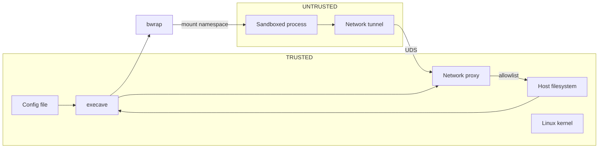

# Security Model

## Threat Model

Execave sandboxes untrusted processes (designed for running AI coding agents) via process and filesystem isolation. The adversary controls everything inside the sandbox but cannot modify execave or its config.

**Protected assets:** Sensitive files (`~/.ssh`, credentials), user data outside project scope, system files, other agents' workspaces.

## Trust Boundaries

## Guarantees

**Kernel-enforced via bwrap:**

| Guarantee | Mechanism |
|-----------|-----------|
| Paths not in config don't exist | Mount namespace isolation |
| `fs:ro` paths unwritable | Read-only bind mounts |
| `fs:none` paths inaccessible | Overlay with tmpfs + chmod 0000 (dirs) or /dev/null (files); dirs with child rules use chmod 0111 for traversal |
| Unlisted paths inaccessible | Default-deny (see architecture.md for mount details) |
| `..` traversal blocked | `filepath.Clean()` at config parse time |
| Symlinks can't escape | Target outside namespace → dangling |
| Config file protected | Config error if explicit; forced read-only if inherited from parent |
| Sandboxed process can't see host processes | PID namespace isolation |
| Sandboxed process can't signal host processes | PID namespace isolation |
| Sandboxed process can't share memory with host | IPC namespace isolation |
| Sandboxed process can't inject terminal input | Kernel TIOCSTI disabling (Linux 6.2+) or `--new-session` fallback (older kernels) |
| Dangerous syscalls blocked | Seccomp-bpf deny-list (ptrace, BPF, io_uring, namespace manipulation, and other privilege-escalation syscalls) |
| No network access by default | Network namespace isolation (`--unshare-all` without `--share-net`) |
| Network access only via allowlist | Forward proxy on UDS enforces net rules; no NIC inside sandbox |
| No DNS exfiltration | No DNS resolver reachable from sandbox |
| No UDP/ICMP covert channels | No network stack; only TCP via proxy |

## Default-Deny Model

Execave distinguishes special filesystems (`/dev`, `/proc`, `/tmp`) from filesystem mounts (explicit only: everything else). See architecture.md for details.

This ensures complete visibility: the config file shows the **entire** filesystem access surface.

## Attacks & Mitigations

| Attack | Mitigation | Residual Risk |
|--------|------------|---------------|
| Read secrets, exfiltrate | Paths don't exist in namespace | Misconfiguration |
| Delete/corrupt files | Unmounted = inaccessible; ro = unwritable | rw paths can be destroyed |
| Symlink escape | Target doesn't exist → dangling | None |
| PATH injection (fake bwrap/strace) | Binary validation: root ownership via Lstat (blocks symlink injection) + not group/world-writable on resolved target; applied to both bwrap and strace because strace is the outermost wrapper (runs outside the sandbox with full host access) | Root-compromised system |
| Path traversal (`../`) | Normalized before sandbox creation | Normalization bugs (fuzz tested) |
| TOCTOU race | Kernel enforcement, no userspace check | None |
| Lateral movement | Separate sandboxes per agent | Shared directory misconfiguration |
| Config tampering | Config error if explicit rw; forced read-only if inherited | Deletion = DoS only |
| Process enumeration | PID namespace - only sees own processes | None |
| Kill/signal host processes | PID namespace - host PIDs don't exist | None |
| Shared memory exploitation | IPC namespace isolation | None |
| Terminal injection (TIOCSTI, CVE-2017-5226) | Kernel blocks TIOCSTI (Linux 6.2+); fallback to `--new-session` on older kernels | None |
| Direct network access | No NIC in sandbox (network namespace isolation) | None |
| DNS exfiltration | No DNS resolver reachable from sandbox | None |
| UDP/ICMP covert channel | No network stack; only TCP relay via proxy | None |
| Bypass proxy via direct connection | No NIC; processes ignoring HTTP_PROXY cannot connect | None |
| Connect to unauthorized host | Proxy enforces allowlist with default-deny | Misconfigured rules |
| Proxy crash/failure | UDS: process death removes listener, new connections fail (fail-closed by design) | None |
| Plaintext over CONNECT tunnel | None: non-MITM relay forwards bytes without inspection; TLS cannot be verified | Plaintext data exchange if remote server cooperates |
| Tunnel binary tampering | Irrelevant: tunnel runs inside sandbox, only exit is UDS to host proxy which enforces filtering; read-only bind mount as defense in depth | None |

## Security-Critical Code

| Area | Risk | Implementation | Verification |
|------|------|----------------|--------------|
| Path normalization | `..`/`.` bypass, tilde escape | `filepath.Clean()` after tilde/relative expansion at config parse time; `~username` rejected; tilde-expanded paths pass identical validation pipeline | Fuzz tests + unit tests + e2e tests |
| Rule resolution | Wrong permission | Longest prefix matching algorithm | Fuzz tests + unit tests + e2e tests |
| bwrap args | Missing bind, wrong flags | Declarative mount generation | Unit tests + e2e tests |
| Mount ordering | Conflicting permissions | Parents first; children overlay | Integration tests + e2e tests |
| Config protection | Future-run escalation | Config validation rejects explicit rw; rule resolver determines inherited permission; synthetic ro rule overlays | Unit tests + e2e tests |
| Net rule resolution | Wrong allow/deny | Single-dimension target specificity: domains (exact > wildcard), IPs (longer CIDR prefix > shorter) | Fuzz tests + unit tests + e2e tests |
| Proxy allowlist | Unauthorized access | Default-deny; protocol+target+port matching via net rules | Unit tests + e2e tests |
| Binary validation | Fake bwrap/strace bypasses sandbox | Lstat root-ownership check (uid 0) on path entry (blocks symlink injection) + Stat root-ownership and write-bit check (mode & 0022 == 0) on resolved target; strace is validated because it wraps bwrap from outside (unsandboxed, full host access) | Unit tests |
| Seccomp filter | Filter bypass or absent filter | Deny-list BPF program: arch check first, then per-syscall JEQ; KILL_PROCESS on wrong arch | Unit tests |
| Syscall allow rules | Per-syscall seccomp bypass | `syscall:allow:<name>` removes a syscall from the BPF deny-list; names validated against blocked list at config parse time | Unit tests + integration tests + e2e tests |

## Safe Usage

- **Config:** Version control. Minimal permissions. Only mount necessary secrets as fs:ro (never fs:rw).
- **Testing:** Use `--monitor` to audit actual access patterns before trusting a config.
- **Incident:** Check file modifications (timestamps, git status) → review config → assess if access was excessive. (`--monitor` too expensive for regular use, so syscall logs typically unavailable.)

## Seccomp Visibility

Only **ruleable** blocked syscalls are traced by the monitor and appear as `SYSCALL` entries in the access log. Defense-in-depth syscalls are blocked silently by the BPF filter without producing access log entries — they can never succeed inside bwrap's user-namespace sandbox, so tracing them would be noise the user cannot act on.

Ruleable syscall attempts are visible as `SYSCALL` entries with `DENY` result and `no-matching-rule` rule (consistent with other resource types). This makes the seccomp filter auditable — users can verify the filter is working and see what the sandboxed process attempted.

`syscall:allow:<name>` rules remove individual syscalls from the seccomp deny-list. **Trust implication:** each allowed syscall re-exposes the kernel attack surface for that syscall. Only allow syscalls that are genuinely required by the workload. Allowed syscalls appear as `SYSCALL` entries with `OK` result.

`syscall:nolog:<name>` rules suppress display of matching `SYSCALL` entries (display-only, same as `fs:nolog`/`net:nolog`).

### Defense-in-depth vs ruleable syscalls

Of the ~34 seccomp-blocked syscalls, 13 require init-namespace capabilities that bwrap's user-namespace sandbox drops and 1 is removed from the kernel entirely (`nfsservctl`, ENOSYS since Linux 3.1). The kernel already prevents these syscalls inside the sandbox, so `syscall:allow` rules cannot meaningfully enable them.

These **defense-in-depth** syscalls remain in the BPF filter (reducing attack surface if the sandbox model changes) but are rejected in config rules. Attempting to use `syscall:allow:<name>` or `syscall:nolog:<name>` for a defense-in-depth syscall produces a config error.

**Defense-in-depth syscalls:** `kexec_load`, `kexec_file_load` (CAP_SYS_BOOT), `init_module`, `finit_module`, `delete_module` (CAP_SYS_MODULE), `settimeofday`, `adjtimex`, `clock_adjtime` (CAP_SYS_TIME), `syslog` (CAP_SYSLOG), `acct` (CAP_SYS_PACCT), `swapon`, `swapoff` (CAP_SYS_ADMIN), `nfsservctl` (ENOSYS).

**Ruleable syscalls** (can be used in config rules): `ptrace`, `bpf`, `io_uring_setup`, `io_uring_enter`, `io_uring_register`, `reboot`, `mount`, `umount2`, `unshare`, `setns`, `pivot_root`, `chroot`, `open_tree`, `move_mount`, `fsopen`, `fsconfig`, `fsmount`, `fspick`, `keyctl`, `add_key`, `request_key`.

## Log Visibility Rules

`fs:log`/`fs:nolog`, `net:log`/`net:nolog`, and `syscall:nolog` rules control which entries are displayed in the web UI. They are **display-only** and have no effect on:
- Access enforcement (bwrap mounts, proxy allow/deny)
- The Logger (all entries are stored unconditionally)
- The sandbox boundary or bwrap invocation

These rules carry no security impact. Using `fs:nolog:/some/dir` to suppress entries does not grant or restrict access to that path; the underlying `fs:ro`/`fs:none`/etc. access rule still applies. Users can always toggle off "Apply nolog rules" in the web UI to see suppressed entries.

## Limitations

- No protection against privileged attackers (root, config modification)
- Not a container runtime
- Environment variables pass through from host (no filtering)
- Defense in depth, not a replacement for code review
- Linux only
- `fs:none` paths remain visible as entries in parent directory listings, but the directories themselves cannot be listed or written to (chmod 0000/0111)
- Monitor logs `UNKNOWN` for symlinks whose targets fall under managed paths (`/dev`, `/proc`, `/tmp`), because these filesystems exist only inside the sandbox's mount namespace and cannot be resolved from the host
- Monitor filters nonexistent paths from the log to reduce noise. Ephemeral files (created and deleted during execution) won't appear due to post-execution checking
- HTTPS enforcement is not possible: the proxy is a non-MITM TCP relay. A `net:http:` rule permits CONNECT tunneling but cannot verify that TLS occurs inside the tunnel; the sandboxed process and remote server can exchange plaintext over the allowed channel
- When `--monitor` is active, strace uses ptrace to trace the sandboxed process. Since Linux allows only one ptracer per process, the sandboxed process cannot use ptrace even if `syscall:allow:ptrace` is configured
- `syscall:allow` rules selectively weaken the seccomp filter; each allowed syscall expands the kernel attack surface
